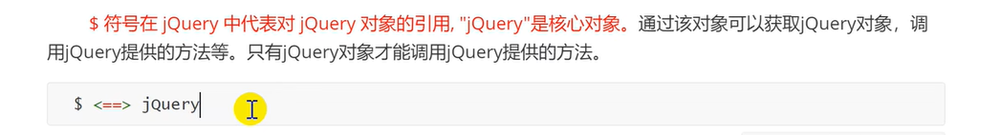

# jQuery
## 1、主要内容

## 2. jQuery对象
jQuery是一套兼容多浏览器的javascript脚本库核心理念是写得更少，做得更多,使用jQuery将极大的提
高编写javascript代码的效率,帮助开发者节省了大量的工作,让写出来的代码更加优雅，更加健壮，"如虎添
翼"。同时网络上丰富的jQuery插件也让我们的工作变成了"有了jQuery, -切so easy。" -因为我们已经站在巨
人的肩膀_上了。

jQuery在2006年1月由美国人John Resig 在纽约的barcamp发布，吸引了来自世界各地的众多
JavaScript高手加入，由Dave Methvin率领团队进行开发。如今, jQuery已经成为最流行的javascript框架，在
世界前10000个访问最多的网站中，有超过55%在使用jQuery。

### 2.1 jQuery的下载与安装
#### 2.1.1. 下载
http://jquery.com

#### 2.1.2 版本

#### 2.1.3 优点
(1)提供了强大的功能函数

(2)解决浏览器兼容性问题

(3)实现丰富的UI和插件

(4)纠正错误的脚本知识

#### 2.1.4. 安装
在页面引入即可

### 2.2 jQuery核心

### 2.3. Dom对象与Jquery包装集对象

